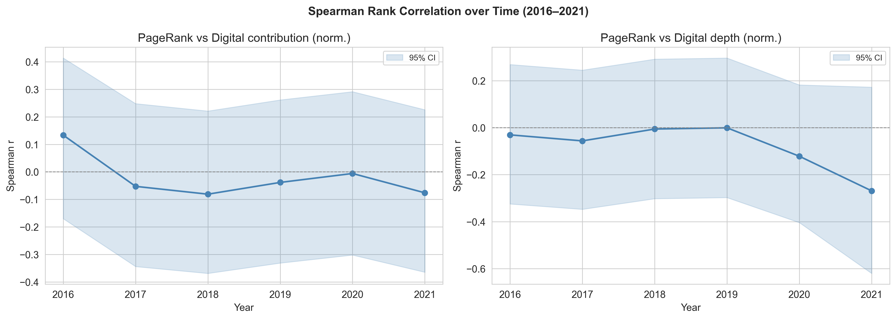
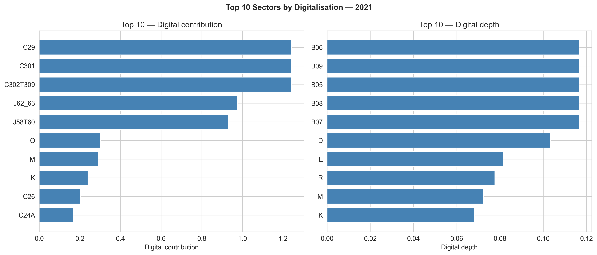
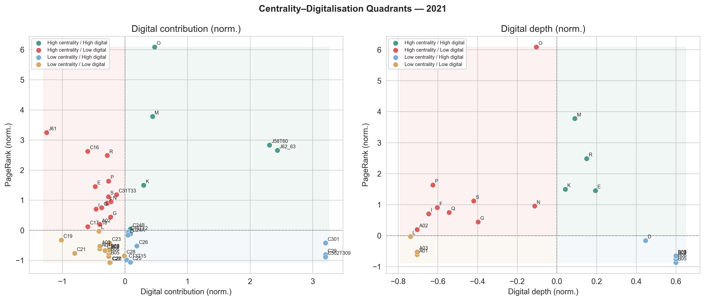

# Digital Transition and Supply-Chain Structure in the Italian Economy

Internet and Network Economics — Group Project 2025-2026

## Introduction
Italy's economy is embedded in a global production network where sectors are interconnected through complex input-output relationships. Some sectors may be structurally central, acting as key suppliers to many downstream activities, while others remain more peripheral. At the same time, sectors differ considerably in their degree of digitalisation, in terms of ICT investment, digital capital intensity, or adoption of digital technologies. The central question of this project is whether these two dimensions, structural centrality and digitalisation, are systematically correlated. Answering this question matters because it speaks to a common assumption in the digital transition literature, namely that all sectors must digitalise to remain competitive and structurally important. The empirical analysis aims to assess whether this association holds for Italy, without making causal or normative claims about what any sector's position implies.

## Economic Logic
Production network propagation. Sectors that are structurally central act as key suppliers to many downstream activities. If digital investment raises productivity, then a central sector that digitalises can propagate efficiency gains broadly through the network, creating a systemic incentive for central sectors to be digitally intensive. This suggests a positive relationship between centrality and digitalisation.
Intangible capital accumulation. Digital investment in software, R&D and ICT capital is a key driver of modern productivity growth, and sectors that face stronger competitive pressures may have greater incentives to accumulate these assets. However, sectors whose centrality is structurally guaranteed, for instance because they supply physically irreplaceable inputs, may face weaker competitive pressure and therefore lower incentives to digitalise, independently of their position in the network.
These two mechanisms generate competing predictions. The first suggests that centrality and digitalisation should go together. The second suggests that certain sectors can maintain structural relevance without digital intensity, depending on the nature of their centrality. The empirical analysis aims to assess which of these patterns characterises Italy's production network.

## Data Sources

The analysis draws on two main datasets.

| Dataset | Source | Content |
|---|---|---|
| OECD ICIO (2025 edition) | OECD | Inter-country input-output flows, 1995 to 2022, 85 countries and country groupings, 50 sectors |
| EUKLEMS Statistical Module | EUKLEMS and INTANProd, LUISS University | Industry-level capital accounts including ICT and non-ICT capital services, 27 EU member states plus UK, US and Japan, 42 industries, 1995 to 2020 |
| EUKLEMS Analytical Module | EUKLEMS and INTANProd, LUISS University | Industry-level investment and capital stocks for intangible assets beyond national accounts boundaries, including software, R&D, organisational capital and brand, same country and industry coverage |

The first dataset is the OECD Inter-Country Input-Output tables, 2025 edition, which provide a globally balanced view of the inter-country and inter-industry flows of goods and services used as intermediate inputs and to meet final demand, covering 85 countries and country groupings across 50 sectors over the period 1995 to 2022. These tables are used to construct the production network and compute sector-level centrality measures for Italy.

The second is the EUKLEMS and INTANProd database, funded by the Directorate General for Economic and Financial Affairs of the European Commission and developed at LUISS University Rome, which provides industry-level data on output, value added, employment, and capital stocks across both tangible and intangible assets for 27 EU member states, the United Kingdom, the United States and Japan, covering 42 industries over the period 1995 to 2020. The database is organised in two modules: a statistical module, which draws directly from national accounts and provides standard growth accounting variables including ICT and non-ICT capital services; and an analytical module, which extends the asset boundary to include intangible assets not recorded as investment under current national accounts standards, notably software and databases, R&D, organisational capital, brand and training.

## Data Processing
The two datasets are processed separately and then merged through a crosswalk between the NACE industry classification used in EUKLEMS and the ICIO sector classification.

### Digitalisation Metrics

Digitalisation is measured using two distinct proxies, each drawn from a different module of the EUKLEMS and INTANProd database and capturing a complementary dimension of digital intensity at the sector level.

- **Digital capital contribution** (`dig_contribution`): This proxy measures the contribution of software and database capital services to value added growth in a given year, as defined in the growth accounting framework (equation 14 of the EUKLEMS methodology). It is drawn from the statistical module, which follows standard national accounts definitions and is available for all countries and industries in the database. It is a **flow measure**: it captures how much software and database capital actually drives output in that year, weighted by its compensation share in value added. It is therefore sensitive to business-cycle conditions and year-to-year investment variation.

$$\text{dig\_contribution}_s = VACon\_Soft\_DB_s$$

- **Digital capital depth** (`dig_depth`): This proxy measures the stock of software and database capital accumulated by a sector relative to its current-price value added. It is drawn from the analytical module, which uses the perpetual inventory method with geometric depreciation to construct capital stocks for intangible assets not recorded under standard national accounts boundaries. It is a **stock measure**: it captures how structurally digitally intensive a sector is, independently of year-to-year fluctuations in investment, and is therefore better suited for cross-sector comparisons of digital depth.

$$\text{dig\_depth}_s = \frac{K\_Soft\_DB_s}{VA\_CP_s}$$

The two proxies are complementary by construction. `dig_contribution` is dynamic and growth-oriented; `dig_depth` is structural and level-oriented. A sector can score high on one and low on the other — for instance, a sector with a large accumulated stock of digital capital that is currently growing slowly, or one investing heavily in a year of rapid expansion despite a modest existing stock.

**Coverage note.** `dig_contribution` is available for all 58 Italian sectors in the growth accounts data. `dig_depth` is available for 49 of those 58 sectors; the remaining 9 — concentrated in distribution (G45, G46, G47), transport (H49–H53) and real estate (L68A) — lack a reliable capital stock estimate from the analytical module's perpetual inventory method. Both proxies are retained in the processed files with missing values where applicable. Sectors missing `dig_depth` are included in any analysis that uses `dig_contribution` alone, and are dropped only from analyses that require both metrics jointly.

Both proxies are normalised using global z-score standardisation before any comparison or visualisation, so that differences in units and scale do not drive the results. See the [Normalisation](#normalisation) section below for details.

## Crosswalk: NACE to ICIO

The two datasets speak different classification languages.

EUKLEMS uses **NACE Rev. 2** codes. In the Italian sample we observe 58 unique NACE codes:

- `A`, `B`, `C`, `C10-C12`, `C13-C15`, `C16-C18`, `C19`, `C20`, `C20-C21`, `C21`, `C22-C23`, `C24-C25`
- `C26`, `C26-C27`, `C27`, `C28`, `C29-C30`, `C31-C33`, `D`, `D-E`, `E`, `F`, `G`, `G45`
- `G46`, `G47`, `H`, `H49`, `H50`, `H51`, `H52`, `H53`, `I`, `J`, `J58-J60`, `J61`
- `J62-J63`, `K`, `L`, `L68A`, `M`, `M-N`, `MARKT`, `MARKTxAG`, `N`, `O`, `O-Q`, `P`
- `Q`, `Q86`, `Q87-Q88`, `R`, `R-S`, `S`, `T`, `TOT`, `TOT_IND`, `U`

ICIO uses its own sector codes and is more granular for several production activities. In the Italian network we use 50 ICIO codes:

- `A01`, `A02`, `A03`, `B05`, `B06`, `B07`, `B08`, `B09`, `C10T12`, `C13T15`
- `C16`, `C17_18`, `C19`, `C20`, `C21`, `C22`, `C23`, `C24A`, `C24B`, `C25`
- `C26`, `C27`, `C28`, `C29`, `C301`, `C302T309`, `C31T33`, `D`, `E`, `F`
- `G`, `H49`, `H50`, `H51`, `H52`, `H53`, `I`, `J58T60`, `J61`, `J62_63`
- `K`, `L`, `M`, `N`, `O`, `P`, `Q`, `R`, `S`, `T`

Some are one-to-one matches with NACE, while others are aggregates or splits. For instance, ICIO `C16` corresponds to NACE `C16-C18`, while ICIO `C26` corresponds to NACE `C26`. ICIO also includes sectors such as `C301` and `C302T309`, both mapping to NACE `C29-C30`.

Another issue is that in some cases more ICIO sectors, such as `A01`, `A02` and `A03`, correspond to a single NACE sector, in this case `A`. This is because the ICIO classification is designed to capture the full structure of global production networks, which requires a more detailed breakdown of certain sectors that play a key role in international trade and supply chains. The NACE classification, by contrast, is designed for national statistical purposes and therefore allows for more aggregation in some areas.

Hence, a direct merge is not possible and a crosswalk is required.

We use ICIO codes as the canonical identifier, since it is much easier to aggregate digitalisation from NACE to ICIO than to disaggregate ICIO sectors into NACE sub-sectors, and we want to preserve the full ICIO network structure.

In the current codebase, the crosswalk is implemented as a dictionary mapping **ICIO to NACE** in `Src/utils/constants.py` (`ICIO_TO_NACE`), for instance:

| ICIO code | NACE code | Mapping type |
|---|---|---|
|C26|C26|one-to-one|
|A01, A02, A03|A|many-to-one|

So the implemented logic is many-to-one at the code-system level (multiple ICIO sectors can map to one NACE code), but the dictionary direction is ICIO -> NACE. ICIO sectors with no NACE match in the EUKLEMS Italy data appear in the centrality panel with missing digitalisation values.

### From Input-Output Flows to a Directed Graph

The starting point of the network analysis is the intermediate flow matrix extracted from the OECD ICIO tables. For a given year, let $z_{ij}$ denote the value of intermediate inputs supplied by sector $i$ to sector $j$, measured in current USD. These flows are recorded for all pairs of the $N = 50$ sectors present in the ICIO tables for the Italian economy.

The raw flow matrix $\mathbf{Z}$ captures the monetary volume of production interdependencies, but it is sensitive to the overall scale of the economy: a large sector will mechanically show large flows even if its structural role is modest. To remove this nominal-size bias, we normalise each column of $\mathbf{Z}$ by the total intermediate input purchases of the receiving sector, obtaining the matrix of Leontief technical coefficients:

$$a_{ij} = \frac{z_{ij}}{\sum_{i} z_{ij}}$$

The coefficient $a_{ij}$ measures the share of sector $j$'s intermediate inputs that originate from sector $i$. It is a structural, scale-invariant quantity: it reflects how dependent sector $j$ is on sector $i$ as a supplier, independently of whether the economy is large or small in absolute terms. This normalisation ensures that the network topology we recover is driven by the organisation of production rather than by nominal magnitudes.

**Sparsification.** The full coefficient matrix is dense by construction, since most entries $a_{ij}$ are positive but very small, representing economically negligible input relationships. We therefore apply a minimum threshold of $a_{ij} \geq 0.01$, retaining only those supplier–buyer relationships in which sector $i$ accounts for at least one percent of sector $j$'s total intermediate purchases. Edges falling below this threshold are set to zero. The threshold is structural rather than data-driven: it filters out noise while preserving all economically meaningful supply linkages.

The resulting object is a weighted directed graph $G = (V, E, w)$, where:

- the node set $V$ contains the global sectors;
- each directed edge $(i \to j) \in E$ indicates that sector $i$ is a meaningful intermediate
  supplier to sector $j$;
- the edge weight $w_{ij} = a_{ij}$ records the intensity of that supply relationship.

This procedure is repeated independently for each year in the window 2016–2021, yielding a sequence of six annual graphs that allow us to assess the stability of the network structure over time.

### Centrality Measures

Four centrality measures are computed for every node in each annual graph. All measures operate on the weighted, directed graph of technical coefficients described above.

- **PageRank**: the stationary distribution of a random walk on the directed graph, where transition probabilities are proportional to edge weights. A sector's PageRank score reflects how much of the global flow of intermediate demand passes through it, accounting for the full recursive structure of the network. This is the primary centrality measure used in the analysis.

- **Betweenness centrality**: the fraction of shortest paths between all pairs of nodes that pass through a given sector, normalised to the unit interval. It captures a sector's role as a structural bridge in the network. Shortest paths are weighted by the inverse of edge weight, so that stronger supply relationships are treated as shorter. Given the size of the graph, betweenness is approximated using a random sample of $k = 500$ pivot nodes.

- **In-strength** and **out-strength**: the sum of incoming and outgoing edge weights for each node, respectively. In-strength measures how intensively a sector draws on other sectors as suppliers; out-strength measures how intensively it supplies inputs to others.

PageRank and betweenness are additionally normalised using global z-score standardisation (across all years jointly), producing `pagerank_norm` and `betweenness_norm`. This facilitates cross-year comparison on a common scale. See the [Normalisation](#normalisation) section below for details.

## Normalisation

Before any comparison or visualisation, all continuous metrics — digitalisation proxies and centrality measures alike — are standardised using **global z-score normalisation**:

$$z_{s,t} = \frac{x_{s,t} - \bar{x}}{\sigma_x}$$

where $\bar{x}$ and $\sigma_x$ are the mean and standard deviation computed over the full pooled sample (all sectors $s$ and all years $t$ jointly). This produces variables with mean zero and unit variance across the entire panel.

### Why global z-scores rather than within-year min-max

An earlier version of the analysis used within-year min-max scaling ($[0, 1]$) applied separately for each year. That approach had two drawbacks:

- **Incomparability across years.** Min-max compresses each year's distribution into $[0, 1]$ independently, so a value of $0.8$ in 2016 and $0.8$ in 2021 carry no common meaning. A sector that became more digitalised over time could show a stable or even declining normalised value if other sectors digitalised faster.
- **Sensitivity to outliers.** Min-max assigns values of exactly 0 and 1 to the annual minimum and maximum, so a single extreme observation can compress all other sectors toward the middle of the scale.

Global z-scores resolve both issues: the scaling parameters are fixed across the panel, so all years and sectors are placed on the same reference frame, and the mean/standard deviation are much more robust to isolated outliers than the range.

### What normalised values mean

- A sector with $z > 0$ is **above the global average** for that variable.
- A sector with $z < 0$ is **below the global average**.
- The natural quadrant split is $z = 0$: sectors above and below the global mean on both axes.

The normalised variables (`pagerank_norm`, `betweenness_norm`, `dig_contribution_norm`, `dig_depth_norm`) are used for all visualisations and the Spearman correlation analysis. Raw values are preserved in the output files for reference.

## Analysis

The analysis examines whether sector-level digitalisation is systematically associated with supply-chain centrality across Italian sectors over the period 2016–2021. The two datasets are merged through the NACE-to-ICIO crosswalk described above, yielding a panel of 49 Italian sectors per year.

### Digitalisation Rankings

For each year, horizontal bar charts display the ten sectors with the highest raw digital capital contribution and the ten sectors with the highest raw digital capital depth. These charts use the unscaled proxies and serve as a descriptive baseline, showing which sectors are most digitalised in absolute terms independently of their network position.

### Correlation Analysis

The statistical relationship between supply-chain centrality and digitalisation is assessed using Spearman rank correlation. For each year and each digitalisation proxy, the Spearman coefficient between `pagerank_norm` and the normalised proxy is computed together with a 95% confidence interval derived from the Fisher $z$-transformation:

$$z = \text{arctanh}(r), \quad \text{SE}(z) = \frac{1}{\sqrt{n-3}}, \quad \text{CI} = \left[\tanh(z - z_{0.025} \cdot \text{SE}),\ \tanh(z + z_{0.025} \cdot \text{SE})\right]$$

Spearman rank correlation is used rather than Pearson because both the centrality and digitalisation distributions are right-skewed, and the research question concerns monotonic association rather than a linear one. Because Spearman operates on ranks, the choice of normalisation method does not affect the results; the normalised and raw series yield identical coefficients.

### Quadrant Classification

Each year, sectors are classified into four quadrants based on their joint position in the centrality-digitalisation space. The split is applied at $z = 0$, i.e. the global mean, for both axes:

| Quadrant | Centrality | Digitalisation |
|---|---|---|
| HH | $\geq 0$ | $\geq 0$ |
| HL | $\geq 0$ | $< 0$ |
| LH | $< 0$ | $\geq 0$ |
| LL | $< 0$ | $< 0$ |

The threshold $z = 0$ corresponds to the pooled global mean across all six years and 49 sectors. It is a natural and stable split: a sector is classified as "high" if it is above the global average for that variable, regardless of year. Because z-score standardisation is performed globally (not within each year), this threshold is consistent across the panel and does not shift with the annual distribution.

## Results and Economic Interpretation

This section reports the main outputs directly from the generated figures and tables.

### Spearman Correlation Over Time

The panel tracks, for each year from 2016 to 2021, the Spearman rank correlation between normalised PageRank (supply-chain centrality) and each of the two digitalisation proxies. The contribution correlation oscillates around zero, with a slight positive value in 2016 that fades and turns modestly negative through 2021. The depth correlation follows a more pronounced downward trajectory, reaching $\rho \approx -0.27$ in 2021. Neither proxy shows a sustained positive association between centrality and digitalisation over the sample period.

### Top-10 Digitalisation Rankings — 2021

**Left panel — Digital capital contribution (`dig_contribution`):** This proxy captures how much software and database capital services contributed to value-added growth in that year. The top three sectors in 2021 are Motor vehicles (`C29`), Building and repairing of ships (`C301`), and Other transport equipment (`C302T309`), all recording the same peak value. This is somewhat surprising: transport manufacturing is not conventionally considered a software-intensive industry. The high contribution likely reflects exceptional ICT investment flows in a post-pandemic recovery year rather than a structural feature of these sectors. IT services and data activities (`J62_63`) and Publishing, audiovisual and broadcasting (`J58T60`) also appear in the top 5 — a more expected result, given that these are intrinsically digital sectors.

**Right panel — Digital capital depth (`dig_depth`):** This proxy measures accumulated software and database capital relative to value added. The top positions are entirely dominated by mining and extraction sectors: Coal mining (`B05`), Oil and gas extraction (`B06`), Other mining (`B08`), Mining support services (`B09`), and Metal ore mining (`B07`) all share the highest depth value. This is a surprising finding. Mining sectors are not typically associated with high digital intensity, but their elevated depth ratio likely reflects a combination of a large accumulated ICT stock (e.g. for geological sensing, remote monitoring and process control) and a relatively modest value-added denominator, inflating the ratio. Electricity and gas supply (`D`) ranks sixth, which is more expected given the digital infrastructure requirements of modern energy networks.

### Centrality-Digitalisation Quadrants — 2021

The scatter plots confirm visually that no strong positive diagonal pattern emerges. In the contribution panel, the highest-centrality sectors (Public administration `O`, Professional services `M`, IT services `J62_63`) are scattered across quadrants, and several of the most digitalised sectors by contribution (transport manufacturing) sit below the global centrality mean. In the depth panel, the mining sectors with the highest depth are all below-average in centrality, placing them in the LH quadrant.

### Results Tables (2016–2021)

The tables below are built from `outputs/tables/sector_panel_YYYY.csv`. Correlations are Spearman between normalised PageRank and the respective digitalisation proxy. Quadrant counts (HH / HL / LH / LL) use $z = 0$ as the split on both axes, computed on non-missing observations. N is the number of sector-year pairs with valid data for both variables.

#### Digital Capital Contribution (`dig_contribution`)

Measures the contribution of software and database capital services to value-added growth in a given year (flow measure from the EUKLEMS Statistical Module).

| Year | N | Spearman ρ | HH | HL | LH | LL |
|---:|---:|---:|---:|---:|---:|---:|
| 2016 | 44 | 0.133 | 5 | 11 | 5 | 23 |
| 2017 | 44 | −0.053 | 6 | 10 | 10 | 18 |
| 2018 | 44 | −0.081 | 5 | 12 | 15 | 12 |
| 2019 | 44 | −0.038 | 10 | 9 | 11 | 14 |
| 2020 | 44 | −0.006 | 3 | 16 | 2 | 23 |
| 2021 | 44 | −0.076 | 6 | 14 | 9 | 15 |

The correlation is close to zero in every year, with a slight positive value in 2016 that does not persist. HL (high centrality, low contribution) is the dominant pattern in most years, suggesting that structurally central sectors tend to sit below the global average for digital capital contribution. The LH count spikes in 2018–2019, driven by manufacturing sectors with above-average contribution but modest centrality.

#### Digital Capital Depth (`dig_depth`)

Measures the stock of software and database capital accumulated by a sector relative to its current-price value added (stock measure from the EUKLEMS Analytical Module). Coverage drops to 22 sectors in 2021 due to missing analytical module data for that year.

| Year | N | Spearman ρ | HH | HL | LH | LL |
|---:|---:|---:|---:|---:|---:|---:|
| 2016 | 44 | −0.031 | 3 | 13 | 7 | 21 |
| 2017 | 44 | −0.056 | 4 | 12 | 3 | 25 |
| 2018 | 44 | −0.006 | 4 | 13 | 7 | 20 |
| 2019 | 44 | −0.001 | 7 | 12 | 9 | 16 |
| 2020 | 44 | −0.122 | 6 | 13 | 11 | 14 |
| 2021 | 22 | −0.269 | 4 | 9 | 6 | 3 |

The depth correlation is consistently negative and worsens over time, reaching $\rho = -0.269$ in 2021. This means sectors with a larger accumulated stock of digital capital tend to be *less* central in the supply chain — the opposite of what the network propagation hypothesis would predict. HL dominates across all years, indicating that the most structurally central sectors (e.g. wholesale trade, manufacturing hubs) maintain their network position without accumulating proportionally large digital capital stocks.

### Interpretation constrained to these outputs

From the visible figures and the tables above, centrality and digitalisation do not move together strongly or consistently across the sample period. Neither proxy shows a sustained positive association with supply-chain centrality. The sectors that lead digital capital contribution in 2021 (transport manufacturing) are structurally peripheral, while the sectors with the deepest digital capital stock (mining and extraction) are also below-average in centrality. The most central sectors — wholesale trade, professional services, public administration — tend to sit in the HL quadrant, maintaining their structural importance independently of their digital intensity.

## Repository Structure and Execution

The repository is currently organised as follows:

- `Src/1_preprocessing.py`: builds annual digitalisation files (`digitalisation_YYYY.csv`) and extracts annual ICIO Z-block files (`icio_zblock_YYYY.csv`).
- `Src/2_network_centrality.py`: computes network centrality indicators from each yearly Z-block and writes `centrality_YYYY.csv`.
- `Src/3_analysis.py`: merges annual centrality and digitalisation files and generates figures and per-year output tables.
- `Src/4_build_dashboard_bundle.py`: generates the dashboard data bundle (`dashboard/data.bundle.js`).
- `Src/5_Full_Pipeline.py`: runs the full workflow end-to-end.
- `dashboard/index.html`, `dashboard/styles.css`, `dashboard/app.js`: interactive dashboard.

Suggested execution order:

1. `python Src/1_preprocessing.py`
2. `python Src/2_network_centrality.py`
3. `python Src/3_analysis.py`
4. `python Src/4_build_dashboard_bundle.py`

Alternative:

1. `python Src/5_Full_Pipeline.py`

To view the dashboard, open `dashboard/index.html` in your browser (or serve via `python -m http.server 8000` and open `/dashboard/index.html`).
